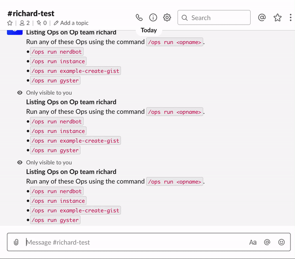

# NerdBot

NerdBot is an Op that enables a team to manage their daily Standups and provides visibility into a team's progress.

In Agile-based software development, a daily Scrum is a pivotal tool that can help organize a team to ensure that the team is on track and adapting to changing requirements.

NerdBot allows a team to conduct daily Standups completely online using Slack. The questions are completely configurable to suit the specific requirements of the team.
The Op also provides the team lead or team members visibility into the whole team's progress, which other teams can track if necessary.

## Requirements
To run this or any other Op, install the [Ops Platform](https://cto.ai/platform).

Find information about how to run and build Ops via the [Ops Platform Documentation](https://cto.ai/docs/overview).

## Usage
1. A team lead would use:
```
/ops run cto.ai/nerdbot:lead
```
to ping specific people in a Slack channel (or use Slack's @here/@channel).

2. The output of running the above version tells those pinged to run the following:
```
/ops run cto.ai/nerdbot
```
This will prompt each team member with questions regarding their progress. The answers are then printed to the Slack channel for visibility to the whole team.



## Local Development/Running from Source
**1. 👯 Clone the repo:**

```bash
git clone <git url>
```

**2. 🔨 Navigate into the directory and build the image:**

```bash
cd nerdbot && ops build .
```

**3. ⚙️  Run the Op from your current working directory with:**

```bash
ops run .
```

**4. ⚙️  To publish the Op to your team:**

```bash
ops publish .
```
To run the Op in Slack, make sure that you have the [CTO.ai Bot](https://cto.ai/platform) installed
in your Slack workspace. To run the Op in a Slack channel, enter: `/ops run nerdbot`

## Debugging Issues
When submitting issues or requesting help, be sure to also include the version information. To get your Ops version run:

```bash
ops -v
```
You can reach us at the [CTO.ai Community Slack](https://cto-ai-community.slack.com/) or email us at support@cto.ai.

## Contributing
See the [Contributing Docs](CONTRIBUTING.md) for more information.

## Contributors
The following people have contributed to this project:
<table>
  <tbody>
    <tr>
      <td align="center" style="width: 80px;">
        <a href="https://gitlab.com/richard.ng">
          <br>
          <sub>@richard.ng</sub>
        </a><br>
      </td>
    </tr>
    </tbody>
</table>

## LICENSE
[MIT](LICENSE)
